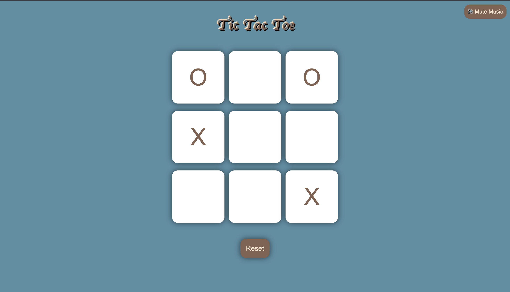
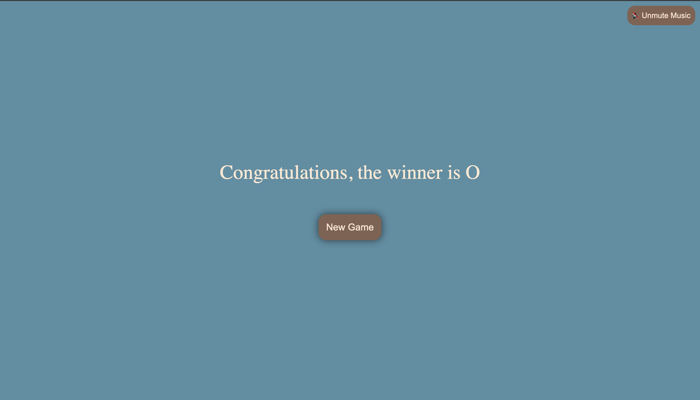
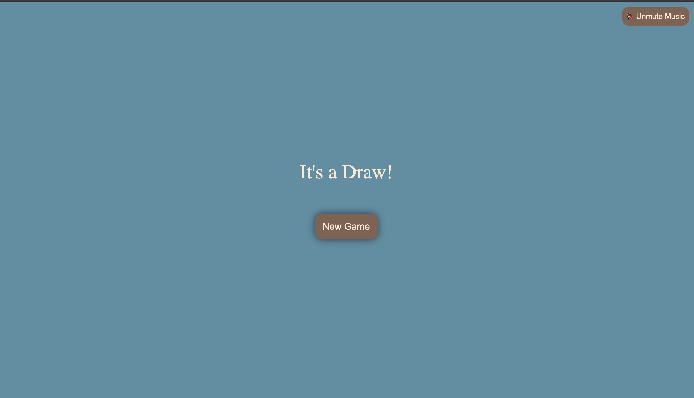

## 🎮 Tic-Tac-Toe Game  

A **classic Tic-Tac-Toe game** built using **HTML, CSS, and JavaScript** with a sleek UI and background music. Play against a friend and enjoy the game with a smooth design and interactive elements.  

### 🌟 Features  
✔️ **Responsive UI** – Works on both desktop and mobile devices  
✔️ **Winner Detection** – Automatically highlights the winner  
✔️ **Draw Detection** – Displays a "Draw" message when no one wins  
✔️ **Background Music** – Plays in the background with a **mute/unmute** button  
✔️ **Reset & New Game Options** – Restart the game anytime  

---

## 📷 Screenshots  




---

## 🛠️ Technologies Used  
- **HTML** – Structure of the game  
- **CSS** – Styling and animations  
- **JavaScript** – Game logic and interactivity  

---

## 🚀 How to Run Locally  
1️⃣ **Clone the repository**  
```bash
git clone https://github.com/yourusername/tic-tac-toe.git
```
2️⃣ **Open `index.html` in a browser**  

---

## 🎵 Background Music  
This game includes a **background music feature**. The music starts **after the first user interaction** (due to browser autoplay restrictions). A **mute/unmute button** is available at the top right.  

---

## 🔧 Future Improvements  
🔹 Add a **PvP mode with AI** 🤖  
🔹 Improve animations & transitions ✨  
🔹 Keep track of **player scores** 🏆  

---

## 🤝 Contributing  
Feel free to fork the repository and submit **pull requests**. Any suggestions or contributions are welcome!  

---

### 🚀 **Enjoy playing Tic-Tac-Toe!** 🏆  
*(If you like this project, give it a ⭐ on GitHub!)*  

---

🔹 Let me know if you need any modifications or **additions**! 😊